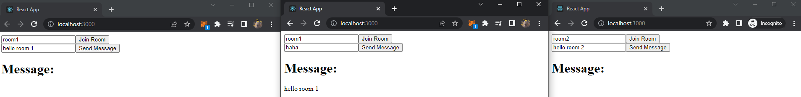

# 04 - Typealong Socket.io + ReactJS Tutorial

## Table of contents

- [Overview](#overview)
  - [The process](#the-process)
  - [Screenshot](#screenshot)
- [My process](#my-process)
  - [Built with](#built-with)
  - [Conclusion](#conclusion)
  - [Useful resources](#useful-resources)

## Overview

### Running the app

1. Clone this repository
2. Run `npm install` on both client and server folder.
3. Run `npm start` on both client and server

### The process

### Screenshot

## My process

### Built with

- [React](https://reactjs.org/) - JS library
- [Socket.io](https://socket.io/) - real-time connection

### Conclusion

- We also can make a "room" that can be used for group chat or private chat

#### Time taken

20+ minutes

### Useful resources

- Source Tutorial: [Click here](https://www.youtube.com/watch?v=djMy4QsPWiI&list=WL&index=3&t=828s)
